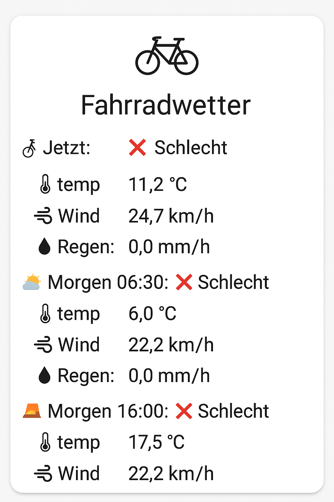

# 🚲 Fahrradwetter für Home Assistant

Diese Konfiguration zeigt dir auf einen Blick, ob das Wetter gerade oder morgen gut fürs Fahrrad ist – inkl. Temperatur, Wind und Regen.

## 🔧 Einrichtung

1. **Standort anpassen:**
   Ersetze `YOUR_LATITUDE` und `YOUR_LONGITUDE` in den YAML-Dateien durch deine Koordinaten  
   *(z. B. `lat=52.52`, `lon=13.41` für Berlin).*

2. **API-Key anpassen:**
   Melde dich bei [OpenWeatherMap](https://openweathermap.org/) an und ersetze `YOUR_API_KEY` durch deinen Key.

3. **Wetterstation (optional):**
   Wenn du eigene Sensoren hast, ersetze:
   - `sensor.DEIN_SENSORNAME_temperature`
   - `sensor.DEIN_SENSORNAME_wind`
   - `sensor.DEIN_SENSORNAME_rain`  
   mit den Namen deiner lokalen Sensoren.

4. **Dateien einfügen:**
   - `sensor_openweathermap_only.yaml` oder `sensor_both.yaml` nach `/config/sensors/` (je nach Nutzung)
   - `dashboard_card.yaml` ins Dashboard via YAML-Modus oder über ein `manual card` in der UI

5. **Custom Button Card installieren:**
   Diese Anzeige benötigt die [button-card](https://github.com/custom-cards/button-card) (HACS empfohlen).

## 🖼️ Vorschau

## ✅ Kriterien für "Gutes Wetter"
- Temperatur über 10 °C  
- Wind unter 15 km/h  
- Kein Regen

---

Viel Spaß beim Radfahren! 🚴
